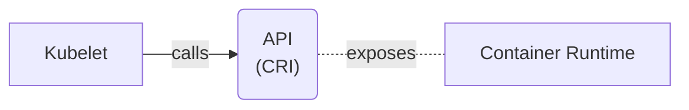
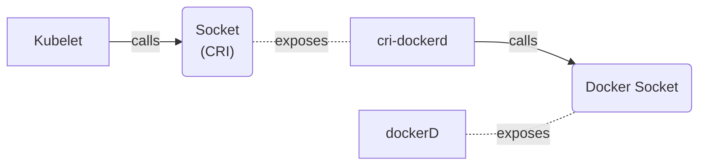
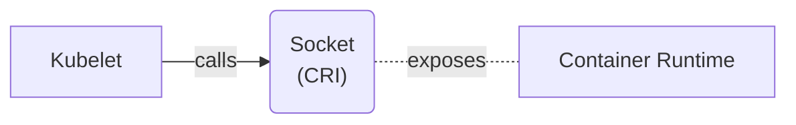

<!--
* who is here for kubelet internals?
* who is here for nice jurassic park references/memes
-->

---
layout: full
---

<div class="grid grid-cols-[1fr_35%] gap-6">

<div>
<h1 style="font-weight: bold;">Who am I?</h1>

<br/>

<h2>Software engineer turned Cloud Enthusiast <noto-cloud /></h2>
<br/>
<h2>Kubernetes wizard <noto-magic-wand /></h2>
<br/>
<h2>Linux Nerd <devicon-linux /></h2>
</div>

<div>

</div>

</div>

<!--
* currently working as a PSE for dynatrace, doesn't sound like i have a lot to do with k8s, but my main area of expertise lies with cloud, k8s, container security
* i originally started my career as a java software engineer, found linux, got suck into ops
* i used arch btw
-->

---
layout: image
image: /journey.png
---


<!--
* six months ago
* colleagues and i were discussing memory requests = limits
* i noticed no idea how kubernetes even enforces those limits
-->

---
layout: section
---

# How does kubernetes enforce memory limits?

---


https://kubernetes.io/docs/concepts/overview/components/

<v-click>
<Arrow x1="300" y1="200" x2="410" y2="300" color="red"/>
</v-click>

<!--
* looking at diagram, i know kublet runs on each node
* from the docs i now know it is responsible for spawning pods
* already first problem, where do we find kubelet source code?
-->

---
layout: section
---

# Where does one find the kubelet source code?

<!--
* first instinct would be kubernetes org on github
* for sure there is kubelet repo
-->

---


<!--
* oh yes,ere is a repo called kubelet
-->

---


<!--
* on closer inspection, this cannot be it
* seems to contain only some API types
* where else could the kubelet source code repo be?
-->

---


<!--
* lets think logical
* kubelet is integral component of kubernetes
* it doesn't have its own repo in gh org
* maybe the kubelet source is located in k8s main repo?
-->

---
layout: image
---


<!--
* went ahead to github
-->

---
layout: image
image: /k8s-clone.png
---


<!--
* cloned the repo
-->

---
layout: image
image: /k8s-folder-vim.png
---


<!--
* opened it in my favorite editor: vim
* which btw is the greatest editor out there if you don't know
* searched for some files/folders called kubelet
-->

---
layout: image
image: /k8s-kubelet.png
---


<!--
* there are plenty
* this has to be it
-->

---
layout: image
image: /unix-system.png
---

<div style="display: flex; flex-direction: row; justify-content: center; align-items: end; height: 100%;">

<p style="font-size: 40px; line-height: 50px; font-weight: bold; text-align: center;">
It's a GOLANG system!<br/>I know this!
</p>

</div>

<!--
* this is me realizing it is all golang
-->

---
layout: image
image: /k8s-kubelet.png
---

---
layout: image
image: /welcome-to-kubelet-source.png
---

<div style="display: flex; flex-direction: row; justify-content: center; align-items: end; height: 100%;">

<p style="font-size: 40px; line-height: 40px; font-weight: bold; text-align: center;">
Welcome,<br/> to the kubelet source code!
</p>

</div>

<!--
* nice with source code located, next question arose
-->

---
layout: section
---

# How does kubelet even start pods?

---
layout: image
image: /stopwatch.png
---


<!--
* in order to finish in this millennia, i will spare you details on kubelet startup process
* this might be topic of another talk
* in a nutshell, kubelets functionality is build around struct called kubelet
-->

---
layout: full
---

<div class="full-center">

```go
// pkg/kubelet/kubelet.go:912
// Kubelet is the main kubelet implementation.
type Kubelet struct {
    // ...
}
```

</div>

<!--
* we are interested in starting pods, there is a method called syncpod
-->

---
layout: full
---

<div class="full-center">

```go
func (kl *Kubelet) SyncPod(ctx context.Context,
                           updateType kubetypes.SyncPodType,
                           pod, mirrorPod *v1.Pod,
                           podStatus *kubecontainer.PodStatus) (bool, error) {
	// ..
}
```

</div>

<!--
* sync pod is responsible for converging a pod in its current state to a wanted state
* tearing down of pods is done in a different method
* sync pod is a pretty complicated method
* it is doing a lot of things
* to stay in reasonable time frame, i will simplify what it does quite heavily and just give you the gist of it
* i recommend you check out the source code yourself
* now lets dive into what sync pod is actually doing
-->

---
class: invert-colors
---

<div class="highlighted-listing">
    <h1 class="current">Creating mirror pod for static pods</h1>
    <h1 class="not-shown">Create Data directories for the pod</h1>
    <h1 class="not-shown">Fetch pull secrets</h1>
    <h1 class="not-shown">Call the container runtime's SyncPod method</h1>
</div>

---
layout: full
---

<div class="full-center">

```go {3-9}
func (kl *Kubelet) SyncPod(/*...*/) (isTerminal bool, err error) {
    // ...
	if kubetypes.IsStaticPod(pod) {
        // ...
        if err := kl.mirrorPodClient.CreateMirrorPod(pod); err != nil {
            // ...
        }
        // ...
	}
	// ...
}
```

</div>

<!--
* this is how it looks like in source code
-->

---
layout: section
---

# Static pods

<!--
* as a quick reminder, static pods are created by putting the pod yaml at a specific location on the node
-->

---

# Pod yamls put in specific folder on node

<v-clicks>

# Folder configured by `staticPodPath`

# Kubelet periodically scans folder

</v-clicks>

<!--
* configured via static pod path kubelet config
* kubelet will periodically scans folder for updates
* it will create new pods for new pod yamls and remove pods for deleted yamls
-->

---
layout: section
---

# Mirror pods

<!--
* now with static pods out of the way, here a quick refresher what mirror pods are
* in short, they are representation of pods in the api server
-->

---

# Representation of static pods in the API server

<v-clicks>

# Will show up as regular pods

# Cannot be controlled via API server

# Modification can only happen in pod yaml on node

</v-clicks>

<!--
* will show up as regular pods
* one important distinction, they cannot be controlled via API server
* if you try to delete or edit mirror pod on api server, nothing will happen
* this can only be achieved by connecting to the node and either deleting pod yaml or editing it
* as we have learned before, kubelet will then in its next cycle pick up the chances and coerce the pod accordingly
-->

---
class: invert-colors
---

<div class="highlighted-listing">
    <h1>Creating mirror pod for static pods</h1>
    <h1 class="current">Create Data directories for the pod</h1>
    <h1 class="not-shown">Fetch pull secrets</h1>
    <h1 class="not-shown">Call the container runtime's SyncPod method</h1>
</div>

<!--
* next up, syncPod will create data directories for pod
-->

---
layout: full
---

<div class="full-center">

```go {11-13}
func (kl *Kubelet) SyncPod(/*...*/) (isTerminal bool, err error) {
    // ...
	if kubetypes.IsStaticPod(pod) {
        // ...
        if err := kl.mirrorPodClient.CreateMirrorPod(pod); err != nil {
            // ...
        }
        // ...
	}
	// ...
	if err := kl.makePodDataDirs(pod); err != nil {
        // ...
	}
	// ...
}
```

</div>

<!--
* once again, here is how it looks like in code
* these data directories are special folders on the node
-->

---

# Folder on the node

<v-clicks>

# Kubelet stores pod related state

# E.g. effective hosts file, resolved secrets ready to be mounted

</v-clicks>

<!--
* which kubelet uses to store pod related state
* examples of this state could be the effective host file, or resolved secrets that will be mounted as volumes in the pod
* it is definitely worth to connect to one of your nodes
-->

---
layout: image
image: /unix-system-files.png
---


<!--
* open your favorite file explorer
* and checkout those pod data dirs in action
* btw jurassic park related fun fact, this is in fact an accurate depiction of the Silicon Graphics 3D File System Navigator for IRIX (an OS based on Unix)
-->

---
class: invert-colors
---

<div class="highlighted-listing">
    <h1>Creating mirror pod for static pods</h1>
    <h1>Create Data directories for the pod</h1>
    <h1 class="current">Fetch pull secrets</h1>
    <h1 class="not-shown">Call the container runtime's SyncPod method</h1>
</div>

<!--
* syncpod is also responsible for fetching pull secrets
-->

---
layout: full
---

<div class="full-center">

```go {15}
func (kl *Kubelet) SyncPod(/*...*/) (isTerminal bool, err error) {
    // ...
	if kubetypes.IsStaticPod(pod) {
        // ...
        if err := kl.mirrorPodClient.CreateMirrorPod(pod); err != nil {
            // ...
        }
        // ...
	}
	// ...
	if err := kl.makePodDataDirs(pod); err != nil {
        // ...
	}
    // ...
    pullSecrets := kl.getPullSecretsForPod(pod)
	// ...
}
```

</div>

<!--
* here is the code
* have you ever tried deploying an pod with an image from a private registry which requires authentication and forget to specify the pull secret?
* if not here is an accurate depiction what will happen
-->

---
layout: image
image: /magic-word-1.png
---

<div style="display: flex; flex-direction: column; justify-content: center; height: 100%;">


<div style="flex-grow: 1"/>

<p style="font-size: 40px; line-height: 35px; font-weight: bold; text-align: center;">
Ah, Ah, Ah, <br/> you didn't say the magic word
</p>

</div>

<!--
* so as you can now imagine, pull secrets are used to authenticate with container registries
-->

---

# Used to authenticate with container registry

<v-clicks>

# Specified by `ImagePullSecrets` field in pod spec

</v-clicks>

<!--
* you can specify the secret via the ImagePullSecrets field in the pod spec
* here is how it looks like in action
-->

---
layout: full
---

<div class="full-center">

```yaml {9-10}
apiVersion: v1
kind: Pod
metadata:
  name: fence-service
spec:
  containers:
  - name: private-reg-container
    image: ingen.com/security/fence-service
  imagePullSecrets:
  - name: ingen-secret
```

</div>

---
class: invert-colors
---

<div class="highlighted-listing">
    <h1>Creating mirror pod for static pods</h1>
    <h1>Create Data directories for the pod</h1>
    <h1>Fetch pull secrets</h1>
    <h1 class="current">Call the container runtime's SyncPod method</h1>
</div>

<!--
* last but not least, syncpod will call the sync pod method of the container runtime
-->

---
layout: full
---

<div class="full-center">

```go {9-10}
func (kl *Kubelet) SyncPod(/*...*/) (isTerminal bool, err error) {
	// ...
	if err := kl.makePodDataDirs(pod); err != nil {
        // ...
	}
    // ...
    pullSecrets := kl.getPullSecretsForPod(pod)
    // ...
	result := kl.containerRuntime.SyncPod(todoCtx,
                    pod, podStatus, pullSecrets, kl.backOff)
	// ...
}
```

</div>

<!--
* this is where the real magic happens
* containerRuntime is a field in the central kubelet struct
-->

---
layout: full
---

<div class="full-center">

```go {3-4}
type Kubelet struct {
    // ...
	// Container runtime.
	containerRuntime kubecontainer.Runtime
    // ...
}
```

</div>

<!--
* tracing down implementations of the Runtime interface pretty much leaves us with one, that is not related to testing, called `kubeGenericRuntimeManager`
-->

---
layout: full
---

<div class="full-center code-small-font">

```go {|3-4|5-6|8-13}
// pkg/kubelet/kuberuntime/kuberuntime_manager.go:1001
func (m *kubeGenericRuntimeManager) SyncPod(/*...*/) (result kubecontainer.PodSyncResult) {
    // Step 1: Compute sandbox and container changes.
	podContainerChanges := m.computePodActions(ctx, pod, podStatus)
	//  2. Kill pod sandbox if necessary.
	//  3. Kill any containers that should not be running.
	// ....
	// Step 4: Create a sandbox for the pod if necessary.
	if podContainerChanges.CreateSandbox {
		// ...
		podSandboxID, msg, err =  m.createPodSandbox(/*...*/)
		// ...
	}
	// ...
	start := func(/*...*/) error {
		if msg, err := m.startContainer(ctx, podSandboxID, /*...*/); err != nil { /*...*/ }
	}
	// Step 5: start ephemeral containers
	// Step 6: start init containers.
	// Step 8: start containers in podContainerChanges.ContainersToStart.
	for _, idx := range podContainerChanges.ContainersToStart {
		start(/*...*/)
	}
}
```

</div>

<!--
* and here is what its syncpod method looks like
* just a reminder, we now moved on from the kubelets syncpod method, to the runtime syncpod method
* i know, can be a bit confusing
* lets dive right in, what do we have here
* step 1 is computing the changes required to get the pods current state into the wanted state
* method is somewhat complicated and not directly related with talk topic, so we will skip over it
* be sure to check it out if you are interested
* we will skip over steps 2-3 as they are related to killing, which is not what we are currently investigating. just as a reminder, we are currently on a mission to figure out how pods are started
* now step 4 looks interesting
* it is creating some kind of pod sandbox, which i have never heard before, lets check it out
-->

---
layout: full
---

<div class="full-center">

```go
func (m *kubeGenericRuntimeManager) createPodSandbox(/*...*/)
                                        (string, string, error) {
    // ...
	podSandBoxID, err :=
        m.runtimeService.RunPodSandbox(ctx, podSandboxConfig, runtimeHandler)
    // ...
}
```

</div>

<!--
* aha, ok, the pod sandbox seems to be created via some kind of runtime service
* once again, there is only a single implementation of this runtime service, not related to testing
* it is called `remoteRuntimeService`
-->

---
layout: full
---

<div class="full-center">

```go {|2|1}
// pkg/kubelet/cri/remote/remote_runtime.go:49
// remoteRuntimeService is a gRPC implementation of internalapi.RuntimeService.
type remoteRuntimeService struct {
    // ...
}
```

</div>

<!--
* by the name of it, i would assume it is communicating with something not on this host, or at least not in the kubelet process
* the godoc is revealing that it is communicating via gRPC
* mhmm the code is located in a subfolder of cri, which rings a bell
* lets hit the kubernetes docs to see if we can learn more about CRI
-->

---
layout: full
---

<div class="stack">


<v-clicks>


</v-clicks>
</div>

<!--
* interesting! CRI stands for container runtime interface and it appears to be a vital puzzle in figuring out how pods are created
* the documentation mentions, that it enables the kubelet to use a wide variety of container runtimes, without having a need to recompile the cluster components
* next up, the doc mentions, that the CRI is the main protocol for communication between kubelet and the container runtime
* ahh ok, so it decouples kubelet from this container runtime component, interesting
-->

---



<!--
* here is a quick visualization of how the components interact with each other
* so the container runtime, exposes some kind of API, which follows the CRI protocol
* kubelet then calls this API
* but what exactly is this container runtime component
-->

---
layout: section
---

# Container Runtime?

<!--
* judging by the name of it, i would say it allows for running containers?
* lets hit the kubernetes docs once again
-->

---
layout: full
---

<div class="stack">


<v-click>

</v-click>

</div>

<!--
* so there is a whole dedicated page on this topic
* and sure enough it mentions, that the container runtime is installed each node, so that pods can run
* so it is responsible for running containers!
-->

---

# Runs containers (duh!)

<v-clicks>

# containerD, CRI-O, Kata Containers, ...

</v-clicks>

<!--
* alright, the docs also mention, that there are various different implementations of container runtime out there
* the most famous ones are containerD and CRI-O
* there is also kata containers, which allow you to run pods as lightweight VMs, isn't that cool
* but wait a sec, what about docker?
-->

---
layout: section
---

# What about Docker?

<!--
* now this is where things get interesting
* did you know, that docker isn't actually offering a CRI compliant API?
-->

---

# Docker != CRI compliant

<v-click>


<div>

# Only usable through Dockershim
removed with 1.24

</div>

</v-click>

<!--
* you could use docker directly up until a few years ago, by leveraging an internal component called Dockershim
*dockershim was deprecated with kubernetes 1.20 and then finally removed with 1.24
* it is still possible to use docker as an container runtime though
* like dr ian malcolm once said
-->

---
layout: image
image: /life-finds-a-way.png
---

<div style="display: flex; flex-direction: row; justify-content: center; align-items: end; height: 100%;">

<p style="font-size: 40px; line-height: 35px; font-weight: bold; text-align: center;">
Docker, ahh, finds a way
</p>

</div>

<!--
* and this way is a special component called cri-dockerd
-->

---

# cri-dockerd

<v-click>

# CRI compliant adapter for docker socket

</v-click>

<!--
* the name pretty much says it all, it is a CRI compliant adapter for the dockerd socket
* the only difference to it and dockershim, you need to install it as an extra component, whereas dockershim was an integral part of kubelet
* this is how it works
-->

---



<!--
* as you can see, cri-dockerd exposes a cri compliant socket, which is used by kubelet
* cri-dockerd then goes ahead and translates all incoming cri calls to docker api calls and sends them to the socker exposed by dockerD
* fun fact over i guess
* but back to the thing that triggers this rabbit hole of container runtimes and cri, what exactly is this mysterious PodSandbox?
-->

---
layout: section
---

# PodSandbox?

<!--
* i couldn't find a lot of details about it online, so here is how i understood it by reading the CRI protobuf files and the implementation of it in containerD
* as we probably all know, containers in a pod share a single network namespace
-->

---

# Network Namespace

<v-clicks>

# Pause Container

# PodSandbox = wrapper around pause container + network namespace

</v-clicks>

<!--
* i am talking about linux namespaces here, not k8s namespaces
* namespaces are the linux kernel way of partitioning system resources
* now, the container runtime spawns a special container, called the pause container, which in the end, is just here to hold the network namespace open and sleep indefinitely
* it technically also does something else, but for sake of simplicity, lets ignore it for now
* at least in containerD, the podsandox is a wrapper this pause container + the network namespace. containerD stores it under a certain ID, which kubelet can later use to spawn containers in
* i am somewhat sure, that this will be different for other container runtimes, so if you happen to have more info on that topic, i would love to hear about it. just find me after the talk.
-->

---
layout: image
image: /hungry-trex.png
---


<!--
* and unlike a hungry t-rex
-->

---
layout: image
image: /hungry-trex-eating.png
---


<!--
* i won't eat you for lunch
* so don't be afraid
* awesome! that was the pod sandbox
* now back to the SyncPod method
-->

---
layout: full
---

<div class="full-center code-small-font">

```go {|19-24|16-18}
// pkg/kubelet/kuberuntime/kuberuntime_manager.go:1001
func (m *kubeGenericRuntimeManager) SyncPod(/*...*/) (result kubecontainer.PodSyncResult) {
    // Step 1: Compute sandbox and container changes.
	podContainerChanges := m.computePodActions(ctx, pod, podStatus)

	//  2. Kill pod sandbox if necessary.
	//  3. Kill any containers that should not be running.
	// ....
	// Step 4: Create a sandbox for the pod if necessary.
	if podContainerChanges.CreateSandbox {
		// ...
		podSandboxID, msg, err =  m.createPodSandbox(/*...*/)
		// ...
	}
	// ...
	start := func(/*...*/) error {
		if msg, err := m.startContainer(ctx, podSandboxID, /*...*/); err != nil { /*...*/ }
	}
	// Step 5: start ephemeral containers
	// Step 6: start init containers.
	// Step 8: start containers in podContainerChanges.ContainersToStart.
	for _, idx := range podContainerChanges.ContainersToStart {
		start(/*...*/)
	}
}
```

</div>

<!--
* the only thing that is left, is starting the containers in the pod
* this is done by leveraging a local function called start
* which in turn is calling the `startContainer` method of the `kubeGenericRuntimeManager`
* lets have a closer look at what it is doing
-->

---
layout: full
---

<div class="full-center code-extra-small-font">

```go {|3-4|6-9}
func (m *kubeGenericRuntimeManager) startContainer(ctx context.Context, podSandboxID string, /*...*/) (string, error) {
	// ...
	// Step 1: pull the image.
	imageRef, msg, err := m.imagePuller.EnsureImageExists(ctx, pod, container, pullSecrets, podSandboxConfig)
	// ...
	// Step 2: create the container.
	// ..	.
	containerConfig, cleanupAction, err := m.generateContainerConfig(ctx, container, pod, restartCount,
																	 podIP, imageRef, podIPs, target)
	// ...
	containerID, err := m.runtimeService.CreateContainer(ctx, podSandboxID, containerConfig, podSandboxConfig)
	// ...
	// Step 3: start the container.
	err = m.runtimeService.StartContainer(ctx, containerID)
	// ...
}
```

</div>

<!--
* the first thing that jumps into my eye here, is step 1. i won't show you the details, but the image puller is calling a method on the CRI to fetch the required images. in the end it kinda makes sense, since the container runtime is the only place that knows how and where to pull the required images

* next up, some kind of container config is created.
-->

---
layout: full
---

<div class="full-center">

```go {|3|4|8-9|11-12|11}
type ContainerConfig struct {
	// ...
	Image *ImageSpec
	Command []string
	Args []string
	WorkingDir string
	Envs []*KeyValue
	Mounts []*Mount
	Devices []*Device
	// ...
	Linux *LinuxContainerConfig
	Windows *WindowsContainerConfig
}
```
</div>

<!--
* which contains information, such as the container to be used, which command to execute, as well as, what mounts and devices to make available to the container at runtime
* it also features two os specific configurations
* lets have a closer look at the linux one
-->

---
layout: full
---

<div class="full-center">

```go {|3}
type LinuxContainerConfig struct {
	// Resources specification for the container.
	Resources *LinuxContainerResources
	// LinuxContainerSecurityContext configuration for the container.
	SecurityContext      *LinuxContainerSecurityContext
}
```

</div>

<!--
* in here, we can see that there are some more linux resource specific configs
-->

---
layout: full
---

<div class="full-center">

```go
type LinuxContainerResources struct {
	CpuPeriod int64
	CpuQuota int64
	CpuShares int64
	MemoryLimitInBytes int64
	// ...
	HugepageLimits []*HugepageLimit
	// ...
}
```

</div>

<!--
* which allows us to specify the CPU shared, period and quotas, as well as some memory limits and huge page limits, nice
-->

---
layout: full
---

<div class="full-center">

```go {|5}
type LinuxContainerConfig struct {
	// Resources specification for the container.
	Resources *LinuxContainerResources
	// LinuxContainerSecurityContext configuration for the container.
	SecurityContext      *LinuxContainerSecurityContext
}
```

</div>

<!--
* the linux container config, also features a security context
-->

---
layout: full
---

<div class="full-center">

```go
type LinuxContainerSecurityContext struct {
	Capabilities *Capability
	Privileged bool
	// ...
	RunAsUser *Int64Value
	RunAsGroup *Int64Value
	// ...
}
```

</div>

<!--
* which looks pretty similar to what we can configure on the pods directly
* there kubelet sets which capabilities to run the container with, as well as if it should be run as privileged and what user or group to use
* now back to the container config
-->

---
layout: full
---

<div class="full-center">

```go {|12}
type ContainerConfig struct {
	// ...
	Image *ImageSpec
	Command []string
	Args []string
	WorkingDir string
	Envs []*KeyValue
	Mounts []*Mount
	Devices []*Device
	// ...
	Linux *LinuxContainerConfig
	Windows *WindowsContainerConfig
}
```
</div>

<!--
* we will just skip over the windows config
-->

---
layout: full
---

<div class="full-center code-extra-small-font">

```go {|11-14}
func (m *kubeGenericRuntimeManager) startContainer(ctx context.Context, podSandboxID string, /*...*/) (string, error) {
	// ...
	// Step 1: pull the image.
	imageRef, msg, err := m.imagePuller.EnsureImageExists(ctx, pod, container, pullSecrets, podSandboxConfig)
	// ...
	// Step 2: create the container.
	// ...
	containerConfig, cleanupAction, err := m.generateContainerConfig(ctx, container, pod, restartCount,
																	 podIP, imageRef, podIPs, target)
	// ...
	containerID, err := m.runtimeService.CreateContainer(ctx, podSandboxID, containerConfig, podSandboxConfig)
	// ...
	// Step 3: start the container.
	err = m.runtimeService.StartContainer(ctx, containerID)
	// ...
}
```

</div>

<!--
* now back at the startContainer function, we can see that now the container is created and started
* it will come as no surprise, that this is done via the CRI
-->

---



<!--
* so createContainer and startContainer pretty much only call the container rutnime, with the config we created before

* nice that is it! there we have it. this is how kubelet spawns containers

* now back to the original question that started this whole journey
-->

---
layout: section
---

# How does kubernetes enforce memory limits?

<!--
* we have already discovered the answer to this! it is a bit disappointing though
* now if we reopen the LinuxContainerResource from the container config struct
-->

---
layout: full
---

<div class="full-center">

```go {|5}
type LinuxContainerResources struct {
	CpuPeriod int64
	CpuQuota int64
	CpuShares int64
	MemoryLimitInBytes int64
	// ...
	HugepageLimits []*HugepageLimit
	// ...
}
```

</div>

<!--
* we can see, that all kubelet needs to do, is to set this `MemoryLimitsInBytes` field
* the rest of it is handled by the container runtime
* if you think about it, it only makes sense that way
* since the CRI abstracts away how containers are run, kubelet has no idea of how it could technically enforce those limits. just think about kata containers. it is spawning dedicated VMs for each container.
-->

---
layout: image
image: /you-did-it.png
---

<div style="display: flex; flex-direction: row; justify-content: center; align-items: end; height: 100%;">

<p style="font-size: 50px; font-weight: bold; text-align: center;">
We did it!
</p>

</div>

<!--
* and that is pretty much it
* we did it!
-->

---
layout: section
---

# Summary Time!

<!--
* now summary time!
* what did we learn today
* first, we now know that the CRI specifies an API that lets kubelet interact with a container runtime
-->

---

## CRI specifies API how kublet interact with container runtime

<br/>

<v-clicks>

<div>

## Various implementation of container runtimes (CRI-O, containerD, kata containers)<!-- .element: class="fragment" data-fragment-index="1" -->
<br/>
</div>

<div>

## Container runtime is actually running containers<!-- .element: class="fragment" data-fragment-index="2" -->

<br/>

</div>


<div>

## Resource limits are imposed by container runtime<!-- .element: class="fragment" data-fragment-index="3" -->

</div>

</v-clicks>

<!--
* there are various container runtimes out there, the most famous ones, being CRI-O containerD

* the container runtime is actually responsible for running containers, however they like. be it local namespaces and cgroups as for containerD, or dedicated micro VMs as in kata containers, in the end, kubelet doesn't care

* the resource limits are actually imposed by the container runtime, due to the before mentioned fact, that the container runtime can run containers with whatever technology it likes and only it knows how to enforce those memory limits

* and that is it! i have to say, i learned quite a lot during this adventure
-->

---
layout: image
image: /making-a-fortune.png
---

<div style="display: flex; flex-direction: row; justify-content: center; align-items: end; height: 100%;">

<p style="font-size: 35px; line-height: 35px; font-weight: bold; text-align: center;">
I am going to make a whole talk/blog <br/> series out of this
</p>

</div>

<!--
* I will try to transform this newly found knowledge into even more talks and probably a whole blog post series. there is quite a lot of interesting stuff going on here.

* be sure to checkout patrickpichler.dev, to not miss any of those blog posts
-->

---

# Checkout https://patrickpichler.dev

<!--
* it is still under construction though

* anyway, I hope you liked the talk and learned a thing or two. if you want to further discuss how pods are spawned, have spotted an error and want to tell me what I got wrong, feel free to approach whenever you see me and lets have a chat!

* thank you
-->

---
layout: image
image: /outro.png
---

<div style="display: flex; flex-direction: row; justify-content: center; align-items: center; height: 100%;">

<p style="font-size: 70px; font-weight: bold; text-align: center;">
The End
</p>

</div>
