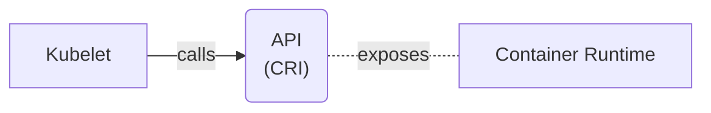
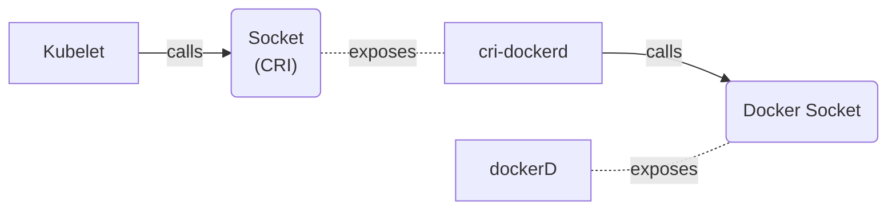
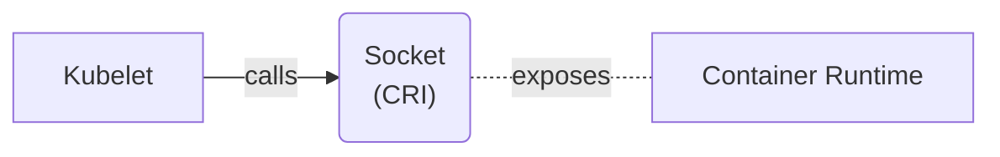

---

<div class="grid grid-cols-[1fr_35%] gap-6">

<div>
<h1 style="font-weight: bold;">Who am I?</h1>

<br/>

<h2>Software engineer turned Cloud Enthusiast <noto-cloud /></h2>
<br/>
<h2>Kubernetes wizard <noto-magic-wand /></h2>
<br/>
<h2>Linux Nerd <devicon-linux /></h2>
</div>

<div>

</div>

</div>

---
layout: image
image: /journey.png
---

---
layout: section
---

# How does kubernetes enforce memory limits?

---


https://kubernetes.io/docs/concepts/overview/components/

---
layout: section
---

# Where does one find the kubelet source code?

---


---


---


---
layout: image
---


---
layout: image
image: /k8s-clone.png
---

---
layout: image
image: /k8s-folder-vim.png
---

---
layout: image
image: /unix-system.png
---

<div style="display: flex; flex-direction: row; justify-content: center; align-items: end; height: 100%;">

<p style="font-size: 40px; line-height: 50px; font-weight: bold; text-align: center;">
It's a GOLANG system!<br/>I know this!
</p>

</div>

---
layout: image
image: /k8s-kubelet.png
---

---
layout: image
image: /welcome-to-kubelet-source.png
---

<div style="display: flex; flex-direction: row; justify-content: center; align-items: end; height: 100%;">

<p style="font-size: 40px; line-height: 40px; font-weight: bold; text-align: center;">
Welcome,<br/> to the kubelet source code!
</p>

</div>

---
layout: section
---

# How does kubelet even start pods?

---
layout: full
---

<div class="full-center">

```go
// pkg/kubelet/kubelet.go:912
// Kubelet is the main kubelet implementation.
type Kubelet struct {
    // ...
}
```

</div>

---
layout: full
---

<div class="full-center">

```go
func (kl *Kubelet) SyncPod(ctx context.Context,
                           updateType kubetypes.SyncPodType,
                           pod, mirrorPod *v1.Pod,
                           podStatus *kubecontainer.PodStatus) (bool, error) {
	// ..
}
```

</div>

---
class: invert-colors
---

<div class="highlighted-listing">
    <h1 class="current">Creating mirror pod for static pods</h1>
    <h1 class="not-shown">Create Data directories for the pod</h1>
    <h1 class="not-shown">Fetch pull secrets</h1>
    <h1 class="not-shown">Register pod probes</h1>
</div>

---
layout: full
---

<div class="full-center">

```go {3-9}
func (kl *Kubelet) SyncPod(/*...*/) (isTerminal bool, err error) {
    // ...
	if kubetypes.IsStaticPod(pod) {
        // ...
        if err := kl.mirrorPodClient.CreateMirrorPod(pod); err != nil {
            // ...
        }
        // ...
	}
	// ...
}
```

</div>

---

# Pod object in the API server

<v-clicks>

# Cannot be controlled via API server

# Created via putting pod yaml at specific location

# Location configured by `staticPodPath`

</v-clicks>

---
class: invert-colors
---

<div class="highlighted-listing">
    <h1>Creating mirror pod for static pods</h1>
    <h1 class="current">Create Data directories for the pod</h1>
    <h1 class="not-shown">Fetch pull secrets</h1>
    <h1 class="not-shown">Register pod probes</h1>
</div>

---
layout: full
---

<div class="full-center">

```go {11-13}
func (kl *Kubelet) SyncPod(/*...*/) (isTerminal bool, err error) {
    // ...
	if kubetypes.IsStaticPod(pod) {
        // ...
        if err := kl.mirrorPodClient.CreateMirrorPod(pod); err != nil {
            // ...
        }
        // ...
	}
	// ...
	if err := kl.makePodDataDirs(pod); err != nil {
        // ...
	}
	// ...
}
```

</div>


---

# Folder on the host

<v-clicks>

# Kubelet stores pod related state

# E.g. effective hosts file, resolved secrets

</v-clicks>

---
layout: image
image: /unix-system-files.png
---

---
class: invert-colors
---

<div class="highlighted-listing">
    <h1>Creating mirror pod for static pods</h1>
    <h1>Create Data directories for the pod</h1>
    <h1 class="current">Fetch pull secrets</h1>
    <h1 class="not-shown">Register pod probes</h1>
</div>

---
layout: full
---

<div class="full-center">

```go {15}
func (kl *Kubelet) SyncPod(/*...*/) (isTerminal bool, err error) {
    // ...
	if kubetypes.IsStaticPod(pod) {
        // ...
        if err := kl.mirrorPodClient.CreateMirrorPod(pod); err != nil {
            // ...
        }
        // ...
	}
	// ...
	if err := kl.makePodDataDirs(pod); err != nil {
        // ...
	}
    // ...
    pullSecrets := kl.getPullSecretsForPod(pod)
	// ...
}
```

</div>

---
layout: image
image: magic-word-1.png
---

<div style="display: flex; flex-direction: column; justify-content: center; height: 100%;">

<p style="font-size: 40px; line-height: 35px; font-weight: bold; text-align: center;">
Me trying to pull an image from a private registry without credentials
</p>

<div style="flex-grow: 1"/>

<p style="font-size: 40px; line-height: 35px; font-weight: bold; text-align: center;">
Container registry:<br/>
Ah, Ah, Ah, <br/> you didn't say the magic word
</p>

</div>

---

# Used to authenticate with container registry

<v-clicks>

# Specified by `ImagePullSecrets` field in pod spec

</v-clicks>

---
layout: full
---

<div class="full-center">

```yaml {|9-10}
apiVersion: v1
kind: Pod
metadata:
  name: private-reg
spec:
  containers:
  - name: private-reg-container
    image: my-private-registry.com/important-image
  imagePullSecrets:
  - name: regcred
```

</div>

---
class: invert-colors
---

<div class="highlighted-listing">
    <h1>Creating mirror pod for static pods</h1>
    <h1>Create Data directories for the pod</h1>
    <h1>Fetch pull secrets</h1>
    <h1 class="current">Register pod probes</h1>
    <h1 class="not-shown">Register pod probes</h1>
</div>

---
layout: full
---

<div class="full-center">

```go {17}
func (kl *Kubelet) SyncPod(/*...*/) (isTerminal bool, err error) {
    // ...
    if kubetypes.IsStaticPod(pod) {
        // ...
        if err := kl.mirrorPodClient.CreateMirrorPod(pod); err != nil {
            // ...
        }
        // ...
    }
    // ...
    if err := kl.makePodDataDirs(pod); err != nil {
        // ...
    }
    // ...
    pullSecrets := kl.getPullSecretsForPod(pod)
    // ...
    kl.probeManager.AddPod(pod)
    // ...
}
```

</div>

---

# Setup of startup, readiness and liveness probes

<v-clicks>

# `probeManager` subsystem

</v-clicks>


---
class: invert-colors
---

<div class="highlighted-listing">
    <h1>Creating mirror pod for static pods</h1>
    <h1>Create Data directories for the pod</h1>
    <h1>Fetch pull secrets</h1>
    <h1>Register pod probes</h1>
    <h1 class="current">Call the container runtime's SyncPod callback</h1>
</div>

---
layout: full
---

<div class="full-center">

```go {11-12}
func (kl *Kubelet) SyncPod(/*...*/) (isTerminal bool, err error) {
	// ...
	if err := kl.makePodDataDirs(pod); err != nil {
        // ...
	}
    // ...
    pullSecrets := kl.getPullSecretsForPod(pod)
    // ...
	kl.probeManager.AddPod(pod)
    // ...
	result := kl.containerRuntime.SyncPod(todoCtx,
                    pod, podStatus, pullSecrets, kl.backOff)
	// ...
}
```

</div>

---
layout: full
---

<div class="full-center">

```go {3-4}
type Kubelet struct {
    // ...
	// Container runtime.
	containerRuntime kubecontainer.Runtime
    // ...
}
```

</div>

---
layout: full
---

<div class="full-center code-small-font">

```go {|3-4|5-6|8-13}
// pkg/kubelet/kuberuntime/kuberuntime_manager.go:1001
func (m *kubeGenericRuntimeManager) SyncPod(/*...*/) (result kubecontainer.PodSyncResult) {
    // Step 1: Compute sandbox and container changes.
	podContainerChanges := m.computePodActions(ctx, pod, podStatus)
	//  2. Kill pod sandbox if necessary.
	//  3. Kill any containers that should not be running.
	// ....
	// Step 4: Create a sandbox for the pod if necessary.
	if podContainerChanges.CreateSandbox {
		// ...
		podSandboxID, msg, err =  m.createPodSandbox(/*...*/)
		// ...
	}
	// ...
	start := func(/*...*/) error {
		if msg, err := m.startContainer(ctx, podSandboxID, /*...*/); err != nil { /*...*/ }
	}
	// Step 5: start ephemeral containers
	// Step 6: start init containers.
	// Step 8: start containers in podContainerChanges.ContainersToStart.
	for _, idx := range podContainerChanges.ContainersToStart {
		start(/*...*/)
	}
}
```

</div>

---
layout: full
---

<div class="full-center">

```go
func (m *kubeGenericRuntimeManager) createPodSandbox(/*...*/)
                                        (string, string, error) {
    // ...
	podSandBoxID, err :=
        m.runtimeService.RunPodSandbox(ctx, podSandboxConfig, runtimeHandler)
    // ...
}
```

</div>

---
layout: full
---

<div class="full-center">

```go {|2}
// pkg/kubelet/cri/remote/remote_runtime.go:49
// remoteRuntimeService is a gRPC implementation of internalapi.RuntimeService.
type remoteRuntimeService struct {
    // ...
}
```

</div>

---
layout: full
---

<div class="stack">


<v-clicks>


</v-clicks>
</div>

---



---
layout: section
---

# Container Runtime?

---
layout: full
---

<div class="stack">


<v-click>

</v-click>

</div>

---

# Runs containers (duh!)

<v-clicks>

# containerD, CRI-O, Kata Containers, ...

</v-clicks>

---
layout: section
---

# What about Docker?

---

# Docker != CRI compliant

<v-click>


<div>

# Only usable through Dockershim
removed with 1.24

</div>

</v-click>

---
layout: image
image: life-finds-a-way.png
---

<div style="display: flex; flex-direction: row; justify-content: center; align-items: end; height: 100%;">

<p style="font-size: 40px; line-height: 35px; font-weight: bold; text-align: center;">
Docker, ahh, finds a way
</p>

</div>

---

# cri-dockerd

<v-click>

# CRI compliant adapter for docker socket

</v-click>

---



---
layout: section
---

# PodSandbox?

---

# Network Namespace

<v-clicks>

# Pause Container

# PodSandbox = wrapper around pause container + network namespace

</v-clicks>

---
layout: image
image: /hungry-trex.png
---

---
layout: image
image: /hungry-trex-eating.png
---

---
layout: full
---

<div class="full-center code-small-font">

```go {19-24|16-18}
// pkg/kubelet/kuberuntime/kuberuntime_manager.go:1001
func (m *kubeGenericRuntimeManager) SyncPod(/*...*/) (result kubecontainer.PodSyncResult) {
    // Step 1: Compute sandbox and container changes.
	podContainerChanges := m.computePodActions(ctx, pod, podStatus)

	//  2. Kill pod sandbox if necessary.
	//  3. Kill any containers that should not be running.
	// ....
	// Step 4: Create a sandbox for the pod if necessary.
	if podContainerChanges.CreateSandbox {
		// ...
		podSandboxID, msg, err =  m.createPodSandbox(/*...*/)
		// ...
	}
	// ...
	start := func(/*...*/) error {
		if msg, err := m.startContainer(ctx, podSandboxID, /*...*/); err != nil { /*...*/ }
	}
	// Step 5: start ephemeral containers
	// Step 6: start init containers.
	// Step 8: start containers in podContainerChanges.ContainersToStart.
	for _, idx := range podContainerChanges.ContainersToStart {
		start(/*...*/)
	}
}
```

</div>

---
layout: full
---

<div class="full-center code-extra-small-font">

```go {|3-4|6-9}
func (m *kubeGenericRuntimeManager) startContainer(ctx context.Context, podSandboxID string, /*...*/) (string, error) {
	// ...
	// Step 1: pull the image.
	imageRef, msg, err := m.imagePuller.EnsureImageExists(ctx, pod, container, pullSecrets, podSandboxConfig)
	// ...
	// Step 2: create the container.
	// ..	.
	containerConfig, cleanupAction, err := m.generateContainerConfig(ctx, container, pod, restartCount,
																	 podIP, imageRef, podIPs, target)
	// ...
	containerID, err := m.runtimeService.CreateContainer(ctx, podSandboxID, containerConfig, podSandboxConfig)
	// ...
	// Step 3: start the container.
	err = m.runtimeService.StartContainer(ctx, containerID)
	// ...
}
```

</div>

---
layout: full
---

<div class="full-center">

```go {|3|4|8-9|11-12|11}
type ContainerConfig struct {
	// ...
	Image *ImageSpec
	Command []string
	Args []string
	WorkingDir string
	Envs []*KeyValue
	Mounts []*Mount
	Devices []*Device
	// ...
	Linux *LinuxContainerConfig
	Windows *WindowsContainerConfig
}
```
</div>

---
layout: full
---

<div class="full-center">

```go {|3}
type LinuxContainerConfig struct {
	// Resources specification for the container.
	Resources *LinuxContainerResources
	// LinuxContainerSecurityContext configuration for the container.
	SecurityContext      *LinuxContainerSecurityContext
}
```

</div>

---
layout: full
---

<div class="full-center">

```go
type LinuxContainerResources struct {
	CpuPeriod int64
	CpuQuota int64
	CpuShares int64
	MemoryLimitInBytes int64
	// ...
	HugepageLimits []*HugepageLimit
	// ...
}
```

</div>

---
layout: full
---

<div class="full-center">

```go {|5}
type LinuxContainerConfig struct {
	// Resources specification for the container.
	Resources *LinuxContainerResources
	// LinuxContainerSecurityContext configuration for the container.
	SecurityContext      *LinuxContainerSecurityContext
}
```

</div>

---
layout: full
---

<div class="full-center">

```go
type LinuxContainerSecurityContext struct {
	Capabilities *Capability
	Privileged bool
	// ...
	RunAsUser *Int64Value
	RunAsGroup *Int64Value
	// ...
}
```

</div>

---
layout: full
---

<div class="full-center code-extra-small-font">

```go {|11-14}
func (m *kubeGenericRuntimeManager) startContainer(ctx context.Context, podSandboxID string, /*...*/) (string, error) {
	// ...
	// Step 1: pull the image.
	imageRef, msg, err := m.imagePuller.EnsureImageExists(ctx, pod, container, pullSecrets, podSandboxConfig)
	// ...
	// Step 2: create the container.
	// ...
	containerConfig, cleanupAction, err := m.generateContainerConfig(ctx, container, pod, restartCount,
																	 podIP, imageRef, podIPs, target)
	// ...
	containerID, err := m.runtimeService.CreateContainer(ctx, podSandboxID, containerConfig, podSandboxConfig)
	// ...
	// Step 3: start the container.
	err = m.runtimeService.StartContainer(ctx, containerID)
	// ...
}
```

</div>

---



---
layout: section
---

# How does kubernetes enforce memory limits?

---
layout: full
---

<div class="full-center">

```go {|5}
type LinuxContainerResources struct {
	CpuPeriod int64
	CpuQuota int64
	CpuShares int64
	MemoryLimitInBytes int64
	// ...
	HugepageLimits []*HugepageLimit
	// ...
}
```

</div>

---
layout: image
image: /you-did-it.png
---

<div style="display: flex; flex-direction: row; justify-content: center; align-items: end; height: 100%;">

<p style="font-size: 50px; font-weight: bold; text-align: center;">
We did it!
</p>

</div>

---
layout: section
---

# Summary Time!

---

## CRI specifies API how kublet interact with container runtime

<br/>

<v-clicks>

<div>

## Various implementation of container runtimes (CRI-O, containerD, kata containers)<!-- .element: class="fragment" data-fragment-index="1" -->
<br/>
</div>

<div>

## Container runtime is actually running containers<!-- .element: class="fragment" data-fragment-index="2" -->

<br/>

</div>


<div>

## Resource limits are imposed by container runtime<!-- .element: class="fragment" data-fragment-index="3" -->

</div>

</v-clicks>

---
layout: image
image: /making-a-fortune.png
---

<div style="display: flex; flex-direction: row; justify-content: center; align-items: end; height: 100%;">

<p style="font-size: 35px; line-height: 35px; font-weight: bold; text-align: center;">
I am going to make a whole talk/blog <br/> series out of this
</p>

</div>

---

# Checkout https://patrickpichler.dev

---
layout: image
image: /outro.png
---

<div style="display: flex; flex-direction: row; justify-content: center; align-items: center; height: 100%;">

<p style="font-size: 70px; font-weight: bold; text-align: center;">
The End
</p>

</div>
